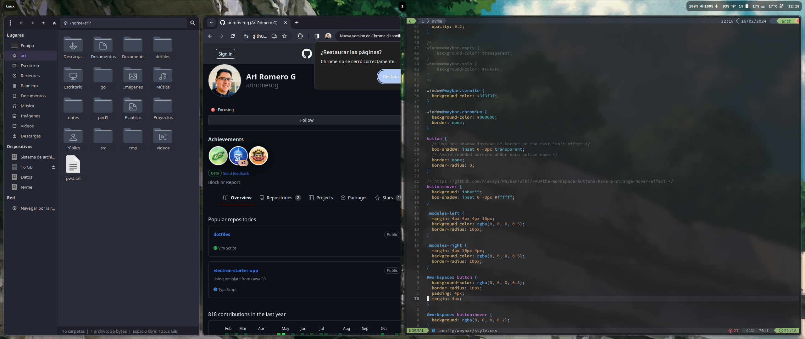

# My Dotfiles

This is my portable configuration for Neovim and Tmux, which I use in MacOS and Linux.

## Dev Environment setup

- Install `fish` and `omf` using your system package manager.
- Install `z` script and `aight` theme using `omf install`.
- Install Neovim and LazyVim.
- Install [tmux](https://github.com/tmux/tmux/wiki) and [tpm](https://github.com/tmux-plugins/tpm).

## Desktop Environment

- Install `hyprland` and `waybar` for tiling window fun.

## Screenshots

  

I use Arch, btw.
