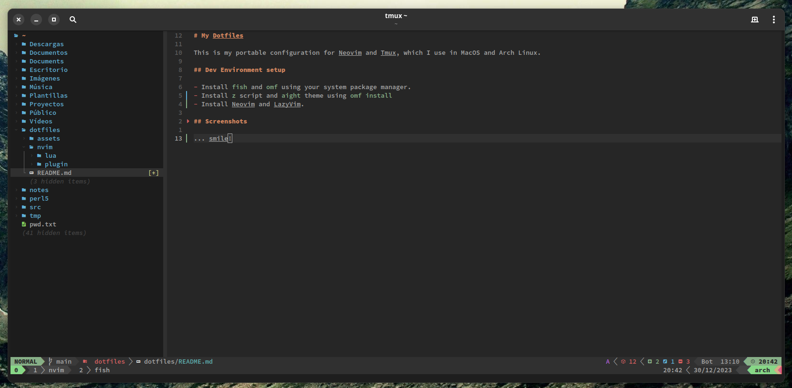

# My Dotfiles

This is my portable configuration for Neovim and Tmux, which I use in MacOS and Linux.

## Dev Environment setup

- Install `fish` and `omf` using your system package manager.
- Install `z` script and `aight` theme using `omf install`
- Install Neovim and LazyVim.

## Screenshots

I use Arch, btw.
