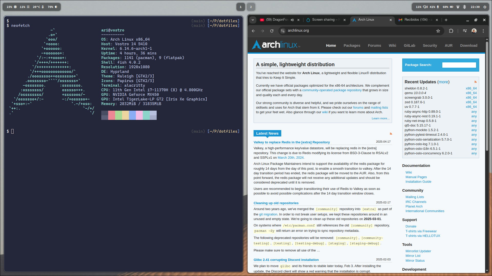

# My Dotfiles

  

## Dev Environment setup

- Install `fish` and `omf` using your system package manager.
- Install `z` script and `aight` theme using `omf install`.
- Install `vim` and a plugin manager. 
- Install `zellij` for terminal multiplexing.

## Desktop Environment

- Install `hyprland` and `waybar` for tiling window fun.
- Optionally install `hyprpaper` and `hyprshot`.
- I recommend `wofi` for launcher and [wofi-power-menu](https://github.com/szaffarano/wofi-power-menu) (see waybar config).

I use Arch, btw.
