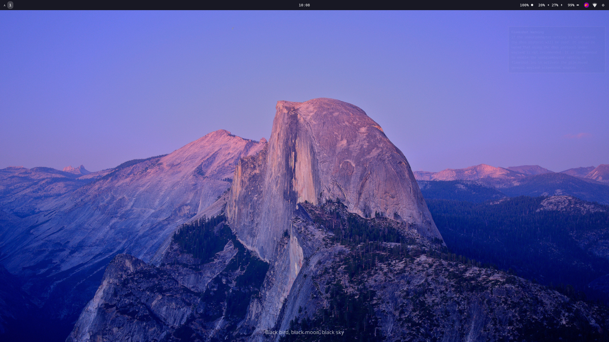
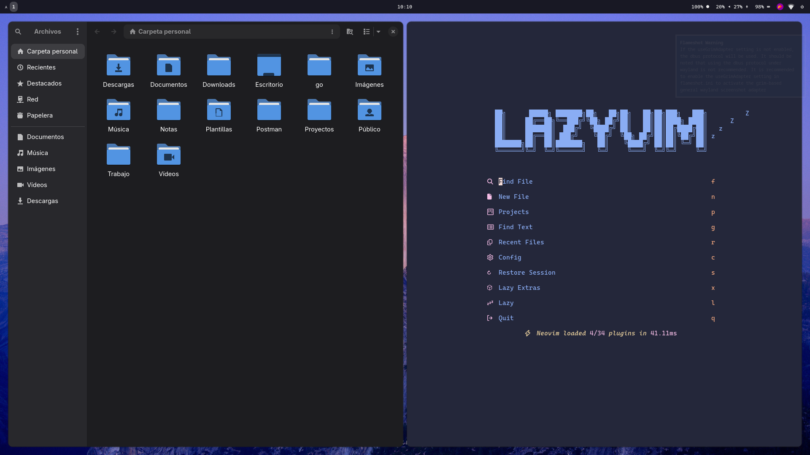

# My Dotfiles

This is my personal dotfiles repository. It contains my configuration for my development environment and my desktop environment. 

<center>
  
  
</center>

Look and feel was heavily inspired by [Omarchy](https://github.com/omarchy), but just keeping the essentials. I'm a big fan of minimalism and simplicity.

## Keybindings

```
- Super + Enter           Open terminal
- Super + space           Open launcher
- Super + w               Open browser
- Super + e               Open file manager
- Super + shift + q       Close window
- Super + shift + escape  Exit Hyprland
```

## Development Environment

- Fish shell with OMF package manager
- Neovim with LazyVim
- Zellij terminal multiplexer

## Desktop Environment

- Hyprland tiling window manager
- Waybar status bar
- Wofi launcher


## Dev Environment setup

- Install `fish` and `omf` using your system package manager.
- Install `neovim` and `lazy.nvim` plugin manager. 
- Install `zellij` for terminal multiplexing.


## Desktop Environment

- Install `hyprland`, `waybar` and `wofi` for tiling window fun.
- Install `hyprpaper` for wallpapers.
- I recommend `flameshot` for screenshots.


